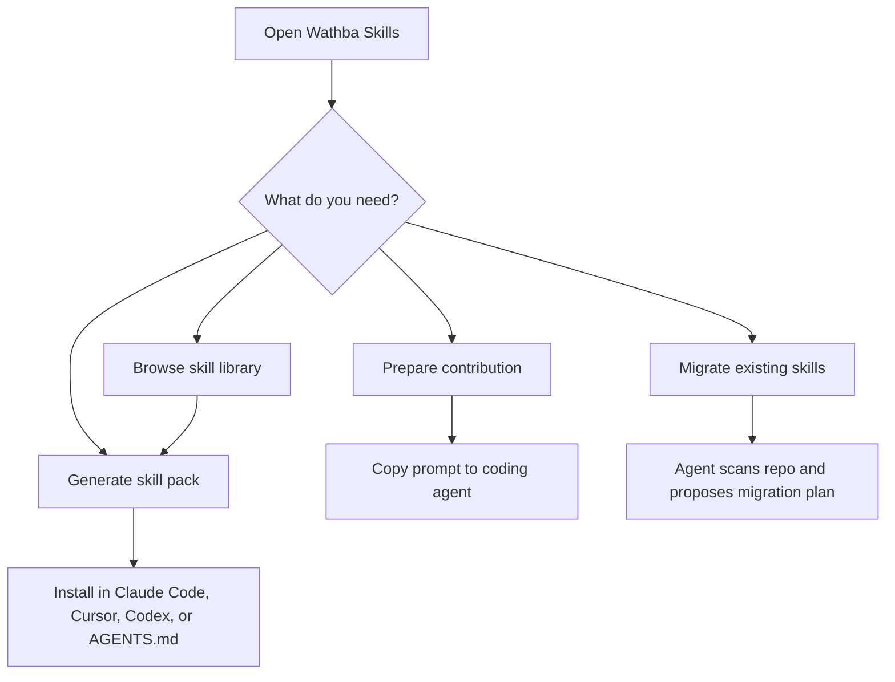

# Wathba Website Documentation

This folder documents how to use the Wathba Skills website and the files it generates.

## Documents

- [Website overview](./website-overview.md) - what the website does and how the main routes fit together.
- [Generate and install a skill pack](./generate-and-install.md) - run the questionnaire, preview files, download the zip, or install through the recommended channel.
- [Skill library guide](./skill-library.md) - browse, filter, inspect, and install individual skills.
- [Contribute a skill](./contribute-a-skill.md) - use the browser wizard to prepare an AI-agent handoff for adding, updating, retiring, or deleting a skill.
- [Migrate existing skills](./migrate-existing-skills.md) - generate a migration prompt or install the reusable migrator skill.
- [Troubleshooting](./troubleshooting.md) - common setup, browser, install, and verification issues.

## User Flow

## Important Guarantees

- The website is static and browser-first.
- The zip generator runs locally in the browser.
- The generated prompts and zip contents are based on canonical skills from `skills/`.
- Compliance skills are engineering guidance, not legal advice.
- Contributor flows do not publish directly from the browser; they prepare prompts for a repo-aware coding agent.
