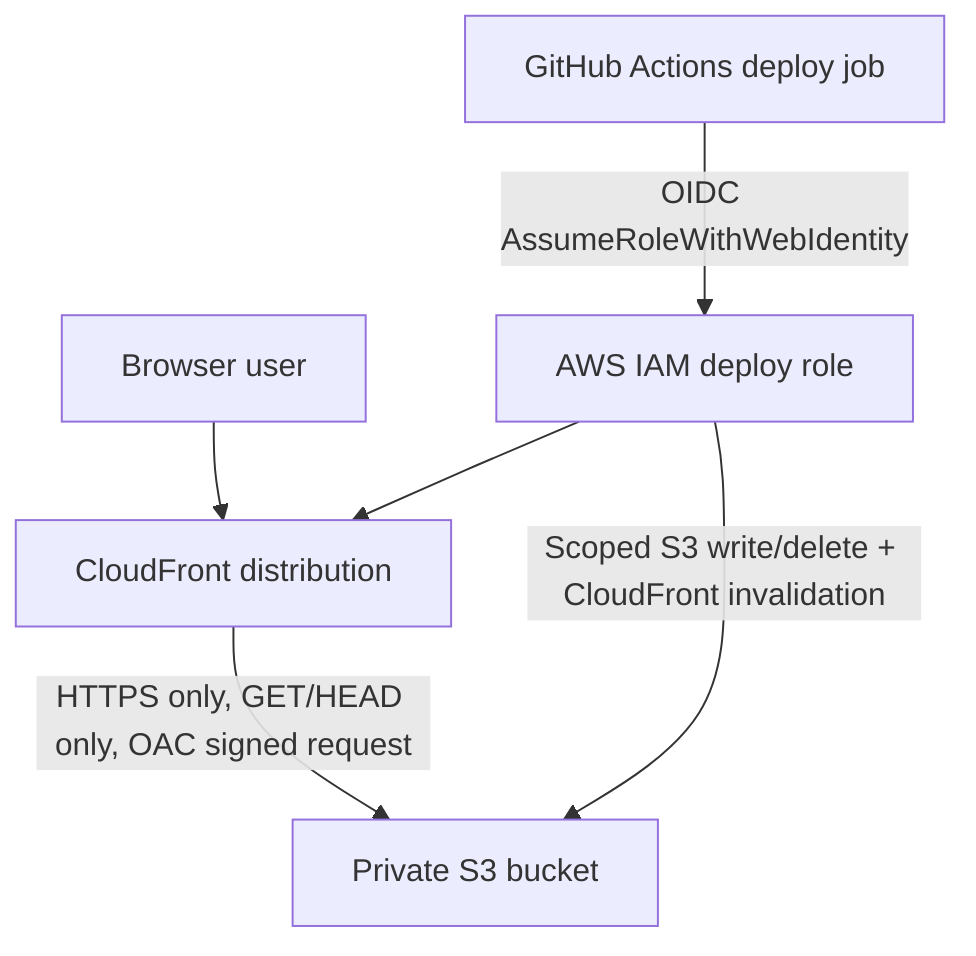
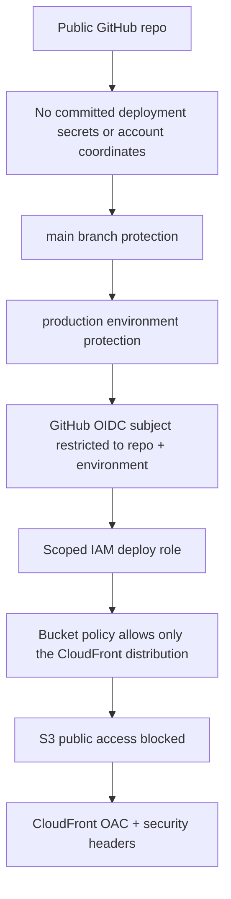

# AWS Static Site Deployment Plan

This is the production deployment plan for the Wathba Auditor static site. The repo is public, so deployment coordinates are intentionally not committed. Keep account IDs, bucket names, role ARNs, distribution IDs, certificate ARNs, and domain names in GitHub environment secrets or local shell variables.

Required GitHub `production` environment secrets:

- `AWS_ACCOUNT_ID`
- `S3_BUCKET`
- `AWS_ROLE_TO_ASSUME`
- `CLOUDFRONT_DISTRIBUTION_ID`

Required GitHub `production` environment variable:

- `AWS_REGION`

Build settings committed in code:

- Branch: `main`
- Build command: `pnpm --filter @agent-skills/web build`
- Output directory: `apps/web/out`
- Package manager: `pnpm@10.33.0`

## Architecture



## Deployment Gate

```mermaid
flowchart LR
  Push["push to main or manual dispatch"] --> Config["validate required GitHub configuration"]
  Config --> Install["pnpm frozen install"]
  Install --> Checks["audit, policy checks, lint, typecheck, unit tests"]
  Checks --> E2E["Playwright e2e tests"]
  E2E --> Export["validate apps/web/out contains no sensitive files"]
  Export --> OIDC["assume AWS role by OIDC"]
  OIDC --> VerifyAWS["verify AWS account, bucket, distribution"]
  VerifyAWS --> Sync["sync S3"]
  Sync --> Invalidate["invalidate CloudFront /*"]
```



## Security Controls



Required protections:

- Enable GitHub branch protection for `main`.
- Require `CI`, `Security`, and deployment checks before merging.
- Protect the GitHub `production` environment and restrict who can approve manual deployments.
- Keep all AWS identifiers in GitHub environment secrets, not committed files.
- Keep S3 Block Public Access fully enabled.
- Use CloudFront Origin Access Control, not S3 static website hosting.
- Attach a CloudFront Function that rewrites static-export directory routes like `/en/` to `/en/index.html`.
- Keep the IAM deploy policy scoped to one bucket and one distribution.
- Keep GitHub OIDC trust scoped to this repo and the `production` environment.

## AWS Provisioning Order

Run live commands only after confirming the active AWS identity:

```bash
aws sts get-caller-identity
```

Set these locally before provisioning. Do not commit the resolved values.

```bash
export AWS_ACCOUNT_ID="<aws-account-id>"
export AWS_REGION="<aws-region>"
export BUCKET_NAME="<project-static-site-bucket>"
export GITHUB_ORG="<github-owner>"
export GITHUB_REPO="<github-repo>"
export ROLE_NAME="<deploy-role-name>"
```

1. Create the private S3 bucket.

```bash
aws s3api create-bucket \
  --bucket "$BUCKET_NAME" \
  --region "$AWS_REGION" \
  --create-bucket-configuration "LocationConstraint=$AWS_REGION"

aws s3api put-public-access-block \
  --bucket "$BUCKET_NAME" \
  --public-access-block-configuration \
  "BlockPublicAcls=true,IgnorePublicAcls=true,BlockPublicPolicy=true,RestrictPublicBuckets=true"
```

2. Create a CloudFront Origin Access Control.

```bash
aws cloudfront create-origin-access-control \
  --origin-access-control-config \
  "Name=${BUCKET_NAME}-oac,Description=OAC for ${BUCKET_NAME},SigningProtocol=sigv4,SigningBehavior=always,OriginAccessControlOriginType=s3"
```

Save the returned Origin Access Control ID locally:

```bash
export OAC_ID="<origin-access-control-id>"
```

3. Create and publish the CloudFront Function for static export route rewrites.

```bash
cat > /tmp/wathba-static-index-rewrite.js <<'JS'
function handler(event) {
  var request = event.request;
  var uri = request.uri;

  if (uri.endsWith('/')) {
    request.uri = uri + 'index.html';
    return request;
  }

  var lastSegment = uri.substring(uri.lastIndexOf('/') + 1);
  if (!lastSegment.includes('.')) {
    request.uri = uri + '/index.html';
  }

  return request;
}
JS

aws cloudfront create-function \
  --name "$GITHUB_REPO-static-index-rewrite" \
  --function-config "Comment=Rewrite static export directory routes to index.html,Runtime=cloudfront-js-2.0" \
  --function-code fileb:///tmp/wathba-static-index-rewrite.js

export FUNCTION_ETAG="$(aws cloudfront describe-function --name "$GITHUB_REPO-static-index-rewrite" --query ETag --output text)"
aws cloudfront publish-function \
  --name "$GITHUB_REPO-static-index-rewrite" \
  --if-match "$FUNCTION_ETAG"

export STATIC_INDEX_REWRITE_FUNCTION_ARN="$(aws cloudfront describe-function --name "$GITHUB_REPO-static-index-rewrite" --stage LIVE --query 'FunctionSummary.FunctionMetadata.FunctionARN' --output text)"
```

4. Render `aws/cloudfront-config.json` from placeholders into a local temporary file, then create the distribution.

```bash
sed \
  -e "s|__CALLER_REFERENCE__|$(date +%s)-wathba-static-site|g" \
  -e "s|__BUCKET_NAME__|$BUCKET_NAME|g" \
  -e "s|__AWS_REGION__|$AWS_REGION|g" \
  -e "s|__OAC_ID__|$OAC_ID|g" \
  -e "s|__STATIC_INDEX_REWRITE_FUNCTION_ARN__|$STATIC_INDEX_REWRITE_FUNCTION_ARN|g" \
  aws/cloudfront-config.json > /tmp/wathba-cloudfront-config.json

aws cloudfront create-distribution \
  --distribution-config file:///tmp/wathba-cloudfront-config.json
```

5. Render and apply the S3 bucket policy after the distribution ID is known.

```bash
export DISTRIBUTION_ID="<cloudfront-distribution-id>"
sed \
  -e "s|__BUCKET_NAME__|$BUCKET_NAME|g" \
  -e "s|__AWS_ACCOUNT_ID__|$AWS_ACCOUNT_ID|g" \
  -e "s|__DISTRIBUTION_ID__|$DISTRIBUTION_ID|g" \
  aws/s3-bucket-policy.json > /tmp/wathba-s3-bucket-policy.json

aws s3api put-bucket-policy \
  --bucket "$BUCKET_NAME" \
  --policy file:///tmp/wathba-s3-bucket-policy.json
```

6. Ensure the GitHub OIDC provider exists.

```bash
aws iam list-open-id-connect-providers
```

If it is missing:

```bash
aws iam create-open-id-connect-provider \
  --url https://token.actions.githubusercontent.com \
  --client-id-list sts.amazonaws.com \
  --thumbprint-list 6938fd4d98bab03faadb97b34396831e3780aea1 1c58a3a8518e8759bf075b76b750d4f2df264fcd
```

7. Render and apply the deploy role trust and scoped inline policy.

```bash
sed \
  -e "s|__AWS_ACCOUNT_ID__|$AWS_ACCOUNT_ID|g" \
  -e "s|__GITHUB_ORG__|$GITHUB_ORG|g" \
  -e "s|__GITHUB_REPO__|$GITHUB_REPO|g" \
  aws/github-oidc-trust-policy.json > /tmp/wathba-github-oidc-trust-policy.json

sed \
  -e "s|__BUCKET_NAME__|$BUCKET_NAME|g" \
  -e "s|__AWS_ACCOUNT_ID__|$AWS_ACCOUNT_ID|g" \
  -e "s|__DISTRIBUTION_ID__|$DISTRIBUTION_ID|g" \
  aws/deploy-policy.json > /tmp/wathba-deploy-policy.json

aws iam update-assume-role-policy \
  --role-name "$ROLE_NAME" \
  --policy-document file:///tmp/wathba-github-oidc-trust-policy.json

aws iam put-role-policy \
  --role-name "$ROLE_NAME" \
  --policy-name WathbaStaticSiteDeployPolicy \
  --policy-document file:///tmp/wathba-deploy-policy.json
```

If the deploy role is shared with other sites, do not overwrite their existing trust or permissions. Add this repo subject and this scoped policy alongside the existing entries, or create a dedicated role for this project.

8. Add GitHub secrets and variables to the protected `production` environment or repository. Prefer environment-level storage so production approval protects the values.

```bash
gh variable set AWS_REGION --env production --body "$AWS_REGION"
gh secret set AWS_ACCOUNT_ID --env production --body "$AWS_ACCOUNT_ID"
gh secret set S3_BUCKET --env production --body "$BUCKET_NAME"
gh secret set AWS_ROLE_TO_ASSUME --env production --body "arn:aws:iam::${AWS_ACCOUNT_ID}:role/${ROLE_NAME}"
gh secret set CLOUDFRONT_DISTRIBUTION_ID --env production --body "$DISTRIBUTION_ID"
```

9. Run the deploy workflow from `main`.

## Post-Deploy Validation

```bash
aws s3api get-public-access-block --bucket "$BUCKET_NAME"
aws s3api get-bucket-policy --bucket "$BUCKET_NAME"
aws cloudfront get-distribution --id "$DISTRIBUTION_ID" --query "Distribution.Status"
curl -I "https://<cloudfront-domain>/"
curl -I "https://<custom-domain>/en/"
```

Expected results:

- S3 public access block is enabled.
- Bucket policy allows reads only from the CloudFront distribution ARN.
- CloudFront returns HTTPS with security headers.
- Directory routes such as `/en/` and `/skills/` return their matching static `index.html`, not the root fallback.
- `.html` and `.json` files are uploaded with no-cache headers.
- Hashed static assets are uploaded with long immutable cache headers.
