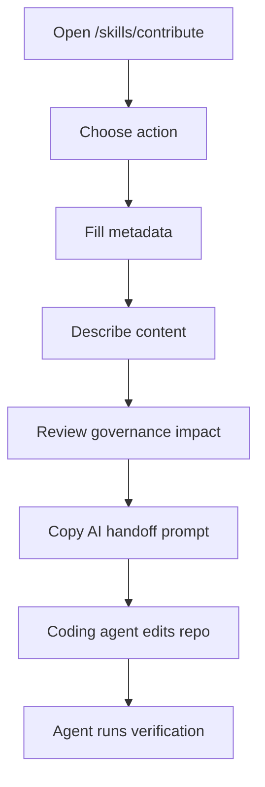

# Contribute A Skill

Use the contribution wizard when you want to prepare a new skill or modify an existing skill with help from an AI coding agent.

The browser does not publish anything. It creates a structured prompt that you paste into Claude Code, Cursor, Codex, or another repo-aware coding agent.

## Contribution Flow



## Supported Actions

| Action | Use when |
| --- | --- |
| Add | Create a brand-new skill under `skills/<group>/<slug>/`. |
| Update | Edit an existing skill's metadata, body, references, or scripts. |
| Retire | Mark a skill as deprecated or archived and point to a replacement when needed. |
| Delete | Hard-delete a skill package. This is advanced maintenance and should be rare. |

Prefer retiring or archiving over hard deletion unless the skill was never released or has no downstream consumers.

## Metadata Step

For new skills, the wizard collects:

- Group folder under `skills/`.
- Slug.
- Skill id.
- English and Arabic names.
- English and Arabic summaries.
- Category.
- Region.
- Targets.
- Status.
- Maintainers.
- Sources.
- Disclaimer flag.
- Variables.
- Triggers.
- Support files.

The wizard auto-derives slug and id from the English name and group until the contributor edits those fields manually.

## Content Step

For add mode, describe what the `SKILL.md` should teach the agent.

Good skill content should include:

- When the skill activates.
- Baseline rules.
- What the agent should do when the repo has no implementation yet.
- Red flags.
- References to support files or official sources.

For update mode, describe the intended edits like a pull request summary.

For retire mode, write a lifecycle note in English and/or Arabic.

For delete mode, provide a rationale and explicit confirmation.

## Governance Step

The wizard estimates the required SemVer bump:

| Bump | Typical changes |
| --- | --- |
| Patch | Body edits, source date updates, summary edits, reference content edits. |
| Minor | New variables, new targets, new support files, lifecycle transitions. |
| Major | Id/slug changes, removed targets, removed variables, hard deletes. |

The final verifier in the repository is authoritative. The wizard estimate is a preview.

## AI Handoff Step

Choose the coding agent target and copy the generated prompt.

The prompt tells the agent to:

- Edit only the relevant skill files.
- Write or update `skill.yaml`.
- Write or update `SKILL.md`.
- Preserve generated-file boundaries.
- Run `pnpm generate:skills`.
- Run `pnpm verify:skills`.
- Report the classifier output from `pnpm verify:skills:versions`.

## Repository Rules For Skill Contributions

Canonical skills live under:

```text
skills/<group>/<slug>/
```

Every skill package must include:

```text
skill.yaml
SKILL.md
```

Optional support files can live under:

```text
references/
scripts/
assets/
templates/
agents/
```

Do not hand-edit generated outputs:

- `apps/web/lib/skills/generated.ts`
- `plugins/wathba-skills/**`
- `.claude-plugin/marketplace.json`

Use the existing generators instead.

## Verification Commands

For skill-only changes:

```bash
pnpm generate:skills
pnpm verify:skills
```

For full release confidence:

```bash
pnpm verify
pnpm verify:full
```
