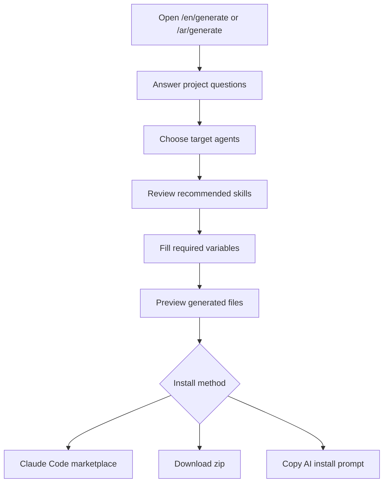

# Generate And Install A Skill Pack

Use the generate page when you want Wathba to recommend skills and package them for your AI coding agent.

## Recommended Flow



## Step 1: About Your Project

The first step asks about the product's market and compliance surface:

- Primary market: Saudi Arabia, broader GCC, or global/other.
- Whether the product issues invoices in Saudi Arabia.
- Whether the product stores personal data.
- Whether the product accepts payments.
- Whether the product verifies identity or performs KYC.

These answers drive Saudi-specific recommendations such as ZATCA Phase 2, PDPL, Nafath/Yakeen, and mada/STC Pay.

## Step 2: Tech And Agents

Pick the backend stack and the agent targets you use.

Backend options include:

- Node.js / TypeScript
- Python
- PHP
- Go
- Other

Agent targets include:

- Claude Code
- Cursor
- OpenAI Codex
- Generic `AGENTS.md`

You must pick at least one target agent before the generator can produce files.

## Step 3: Review And Variables

The review step shows:

- Automatically recommended skills.
- Manually added skills.
- Skill status and version metadata.
- Compliance disclaimer indicators.
- Any variables required by selected skills.

Keep only the skills you want in the output. Fill every required variable before downloading.

## Step 4: Generate

The final step shows:

- Total generated file count.
- Selected skills.
- Selected targets.
- A target-specific file preview.
- Download and AI-install options.

The zip is created locally in the browser.

## Install Option: Claude Code Marketplace

For Claude Code users, prefer the marketplace flow:

```text
/plugin marketplace add wathba-dev/wathba_auditor
/plugin install wathba-skills@wathba
```

After install, reload plugins if your Claude Code session requires it:

```text
/reload-plugins
```

This gives Claude Code the Wathba plugin skills and slash commands.

## Install Option: Manual Zip

Use the zip when:

- You need Cursor, Codex, or generic `AGENTS.md` output.
- You are offline or in an air-gapped environment.
- Your agent cannot install from the Claude marketplace.
- The AI prompt is too large for your agent context.

Extract the zip into the root of the repository where your coding agent works.

## Install Option: AI Prompt

The AI prompt path gives you one prompt to paste into a coding agent. The agent writes the generated files into the correct target paths.

Use this when:

- You want your agent to create the files for you.
- You want the agent to explain what it wrote.
- You are using an agent that can edit local files but does not support zip import.

Use the zip instead if the prompt is too large or contains binary support files.

## Output Paths

| Target | Output |
| --- | --- |
| Claude Code | `.claude/skills/<slug>/SKILL.md` |
| Cursor | `.cursor/rules/<slug>.mdc` and `.cursor/skills/<slug>/SKILL.md` |
| Codex | `.agents/skills/<slug>/SKILL.md` |
| Generic | `AGENTS.md` |

## Verification After Install

After installing into a project:

1. Confirm the generated files exist in the target path.
2. Restart or reload your coding agent if it only discovers skills at startup.
3. Ask the agent to list or summarize the installed Wathba skills.
4. For compliance-sensitive work, review the linked official sources before shipping.
