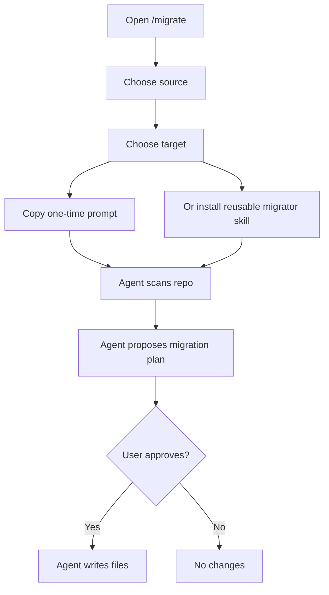

# Migrate Existing Skills

Use the migrator when you already have Claude Code skills, commands, or plugin packages and want an AI coding agent to convert them into another target format.

The migration flow is intentionally plan-first. The generated prompt allows the agent to scan and propose a plan, but it must wait for approval before writing files.

## Supported Source

The first supported source is Claude Code. The migration prompt asks the agent to inspect:

- `.claude/skills`
- `.claude/commands`
- `.claude-plugin` metadata
- Plugin folders

## Supported Targets

| Target | Result |
| --- | --- |
| Claude Code | Normalize skills back into `.claude/skills`. |
| Cursor | Create `.cursor/skills` packages and matching `.cursor/rules` files. |
| Codex | Create `.agents/skills` packages and require the agent to use the Codex skill-creator workflow when available. |
| Generic `AGENTS.md` | Merge guidance into a repo-level `AGENTS.md` without overwriting unrelated instructions. |
| Custom agent | Ask the agent to confirm target path, directory pattern, and entry filename before writing. |

## Migration Flow

## One-Time Prompt

Use the one-time prompt when you only need to migrate one repository.

Steps:

1. Open `/en/migrate` or `/ar/migrate`.
2. Choose the source and target.
3. Copy the prompt.
4. Paste it into the coding agent with the target repository open.
5. Review the plan.
6. Approve only if the paths and file operations are correct.

## Reusable Migrator Skill

Install the reusable migrator skill if you expect to migrate multiple repositories.

Target-specific install paths:

| Agent | Path |
| --- | --- |
| Claude Code | `.claude/skills/skill-migrator/SKILL.md` |
| Cursor | `.cursor/skills/skill-migrator/SKILL.md` plus rule file |
| Codex | `.agents/skills/skill-migrator/SKILL.md` |

The reusable skill still follows the same approval gate.

## Approval Checklist

Before approving a migration plan, check:

- The agent found the correct source files.
- The target path matches the agent you use.
- Existing instructions will not be overwritten without merge logic.
- Commands and skills are not collapsed into one unclear file unless you chose generic `AGENTS.md`.
- Any unsupported plugin behavior is called out as a limitation.

## After Migration

1. Inspect generated files.
2. Restart or reload the target coding agent.
3. Ask the agent to summarize the migrated skills.
4. Run project checks if the migration changed repository files.
