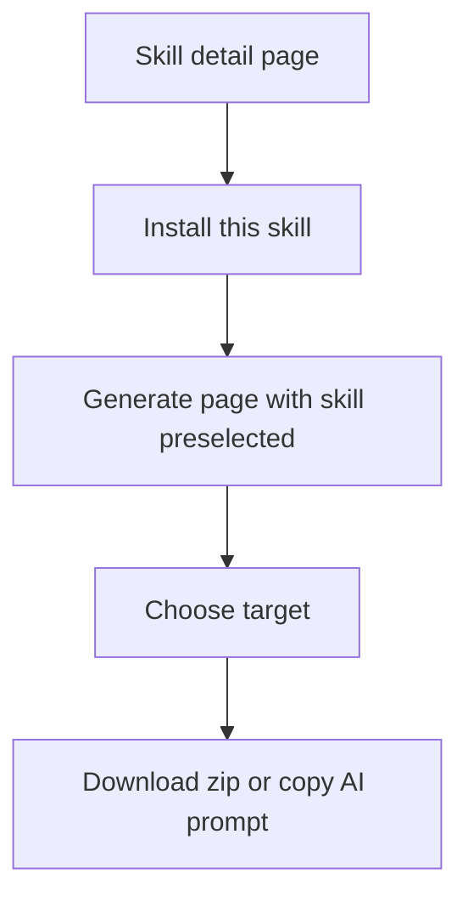

# Skill Library Guide

Use the skill library to inspect the canonical Wathba skills before generating or installing them.

## Browse The Library

Open:

- `/en/skills`
- `/ar/skills`

The library shows every skill emitted from the canonical `skills/` tree.

## Filters

The library supports filters for:

- Category
- Status
- Lifecycle

Categories include:

- Saudi compliance
- Security
- Architecture

Statuses include:

- Reviewed
- Community
- Draft

Lifecycle values include:

- Active
- Deprecated
- Archived

Archived skills are hidden from default discovery and only appear when explicitly selected.

## Skill Cards

Each card includes:

- Skill title.
- Category.
- Status.
- Version.
- Last verified date.
- Disclaimer indicator when applicable.
- Lifecycle badge when deprecated or archived.

## Skill Detail Page

Open a skill detail page to inspect:

- Canonical metadata.
- Supported targets.
- Variables.
- Sources and access dates.
- Maintainers.
- References.
- Scripts.
- Asset inventory.
- Raw `SKILL.md` preview.

## Install A Single Skill

From a detail page, use the install action to open the generate flow with that skill preselected. Then choose the target agent and install method.

## How To Read Skill Quality

| Field | Meaning |
| --- | --- |
| `Version` | Skill SemVer. Changes are governed by repository checks. |
| `Last verified` | Date the skill sources were last checked. |
| `Status` | Editorial maturity, not lifecycle. |
| `Lifecycle` | Discoverability state. |
| `Sources` | Official or authoritative references for the skill. |

Draft skills can still be useful, but should be treated as starting points.

## Compliance Disclaimer

Compliance skills are engineering guidance only. They are not legal, financial, regulatory, or certification advice. Always verify against official sources and involve a qualified specialist before shipping compliance-sensitive behavior.
