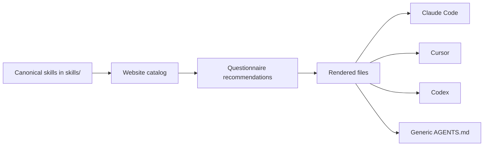

# Website Overview

Wathba Skills helps teams install agent skills for Saudi compliance, security hygiene, and architecture discipline. The website is a static Next.js app with English and Arabic routes.

## Main Routes

| Route | Purpose |
| --- | --- |
| `/en` and `/ar` | Landing page with a product explanation and library preview. |
| `/en/skills` and `/ar/skills` | Browse the full skill library. |
| `/en/skills/<id>` and `/ar/skills/<id>` | Inspect one skill's metadata, sources, support files, and `SKILL.md` body. |
| `/en/generate` and `/ar/generate` | Answer the questionnaire and generate installable skill files. |
| `/en/skills/contribute` and `/ar/skills/contribute` | Prepare a governed contribution prompt for a coding agent. |
| `/en/migrate` and `/ar/migrate` | Generate a migration prompt or install a reusable migrator skill. |

## What The Website Produces

## Supported Targets

| Target | Generated path |
| --- | --- |
| Claude Code manual zip | `.claude/skills/<slug>/SKILL.md` |
| Cursor | `.cursor/rules/<slug>.mdc` and `.cursor/skills/<slug>/SKILL.md` |
| OpenAI Codex | `.agents/skills/<slug>/SKILL.md` |
| Generic fallback | `AGENTS.md` |

Claude Code also has a recommended marketplace/plugin install path documented in [Generate and install](./generate-and-install.md).

## Language And Direction

Every primary route exists in English and Arabic:

- English routes use `lang="en"` and `dir="ltr"`.
- Arabic routes use `lang="ar"` and `dir="rtl"`.

If a route renders with the wrong direction, treat it as a release bug.

## Privacy Model

- The questionnaire runs in the browser.
- Zip packaging runs in the browser.
- The website does not require an account.
- Generated prompts are copied by the user into their own coding agent.
- The contribution wizard does not write to GitHub or the filesystem by itself.
